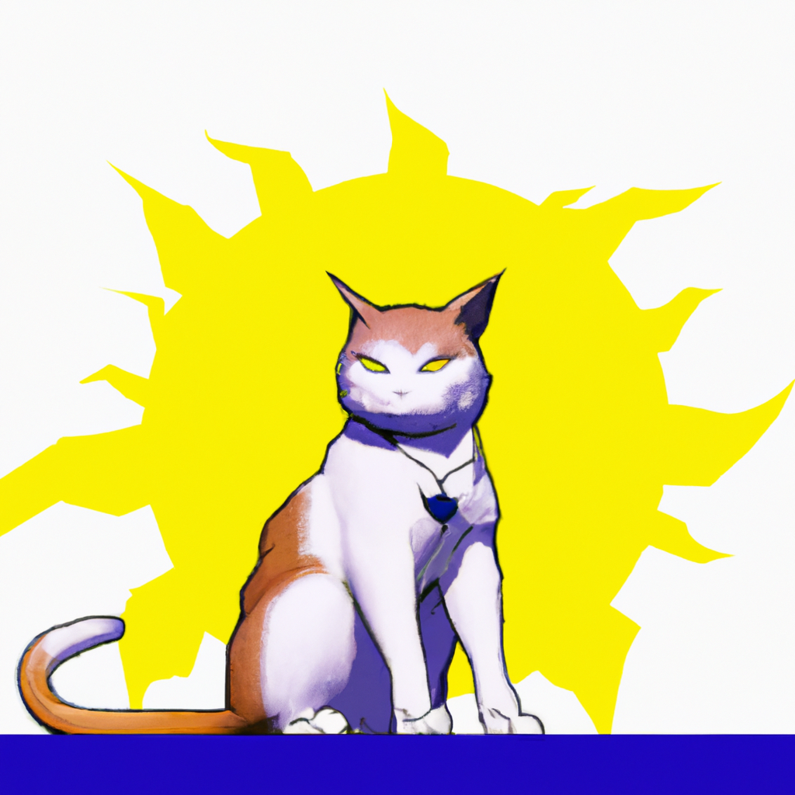

# Gambarin

Gambarin is a powerful and user-friendly ChatGPT image generation tool that allows you to quickly generate images by simply providing prompts through the command-line interface (CLI). With Gambarin, you no longer need to open a separate website or chat with GPT models online to generate images. You can do it directly from your command-line interface, making it a convenient and efficient way to generate images on the go.


## Installation

Install the project with npm

```bash
npm i gambarin -g
```

## Setup
Firstly, you need to set your API key.

1. Get your API key from [OpenAI](https://platform.openai.com/account/api-keys). Make sure you add payment details so the API works.

2. Set your api_key to gambarin like so:
```bash
gambarin api_key=<your_api_key>
```

3. Done :)


## Result

There is some result from that command:





    
## Usage

You can directly generate an image from your CLI! :)

```bash
gambarin p="a cat with sun power in anime style"
```

***Note*** : make sure you use quotation marks after `p=` as usage example so it's detected as one line prompt.

